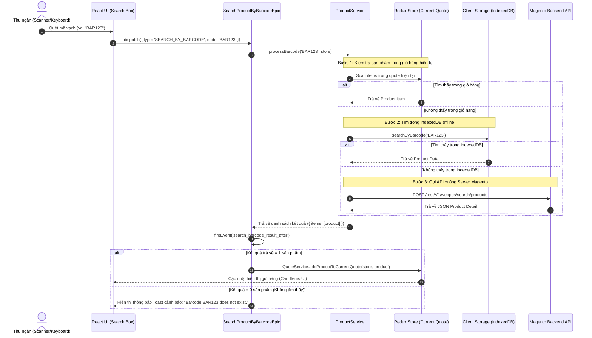

# 🔍 Luồng Dữ liệu: Tìm kiếm sản phẩm bằng Mã vạch (Search Product by Barcode)

## 1. Tổng quan (Overview)
Luồng này xử lý khi thu ngân quét mã vạch (Barcode Scanner) hoặc nhập chuỗi mã vạch thủ công tại ô tìm kiếm sản phẩm trên màn hình POS Checkout. 
Hệ thống ưu tiên tối ưu tốc độ bằng cách:
1. Kiểm tra mã vạch trong giỏ hàng hiện tại (Current Cart Quote).
2. Nếu không có, tìm kiếm trong cơ sở dữ liệu Client (IndexedDB / Local Storage).
3. Nếu không có ở Client, gửi request lên Backend API Magento 2.
4. Tự động thêm sản phẩm vào giỏ hàng nếu tìm thấy duy nhất 1 sản phẩm.

---

## 2. Các thành phần tham gia (Components Involved)

### 🎨 Frontend / Client (ReactJS & Redux-Observable)
- **UI Component:** `src/view/component/checkout/SearchProduct.js` (Lắng nghe sự kiện gõ/quét mã vạch).
- **Redux Action:** `ProductConstant.SEARCH_BY_BARCODE` (Payload: `{ code: "123456" }`).
- **Epic Xử lý Bất đồng bộ:** `src/view/epic/product/SearchProductByBarcodeEpic.js`.
- **Product Service:** `src/service/catalog/ProductService.js`.
- **Resource Model:** `src/resource-model/catalog/ProductResourceModel.js`.
- **Quote Service:** `src/service/checkout/QuoteService.js` (Thêm sản phẩm vào Quote).

### ⚙️ Backend / Server (Magento 2 PHP)
- **REST API Endpoint:** `POST /rest/V1/webpos/search/products`
- **Model Resolver:** `Magestore\Webpos\Model\Resolver\SearchProduct` (Hoặc Barcode Search Model).

---

## 3. Sơ đồ Luồng Dữ liệu (Data Flow Diagram)

---

## 4. Chi tiết xử lý Logic (Business Logic & Gotchas)

1. **Chuỗi Mã vạch nhiều mã (Multiple Barcodes):**
   - Trong thuộc tính `pos_barcode`, các mã vạch phân cách bằng dấu phẩy `,` (ví dụ `,BAR123,BAR456,`).
   - Hàm `processBarcode` trong `ProductService.js` kiểm tra bằng `item.product.pos_barcode.includes(',' + code + ',')`.

2. **Xử lý Sản phẩm Phức tạp (Configurable / Bundle):**
   - Nếu mã vạch quét ra sản phẩm con (Simple Child Product) thuộc sản phẩm Configurable, hệ thống tự động tìm và chọn các thuộc tính tương ứng để đưa đúng sản phẩm con đó vào giỏ hàng.

3. **Performance Monitoring:**
   - Luồng này được đo lường thời gian thực thi bởi `PerformanceService.stopMeasure(PerformanceConstant.SCAN_BARCODE)` nhằm đảm bảo trải nghiệm quét sản phẩm liên tục không bị trễ (lag).
