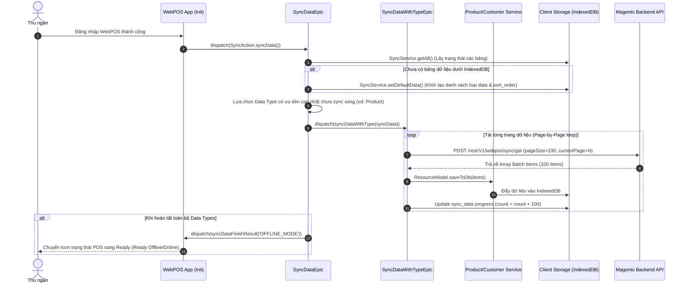
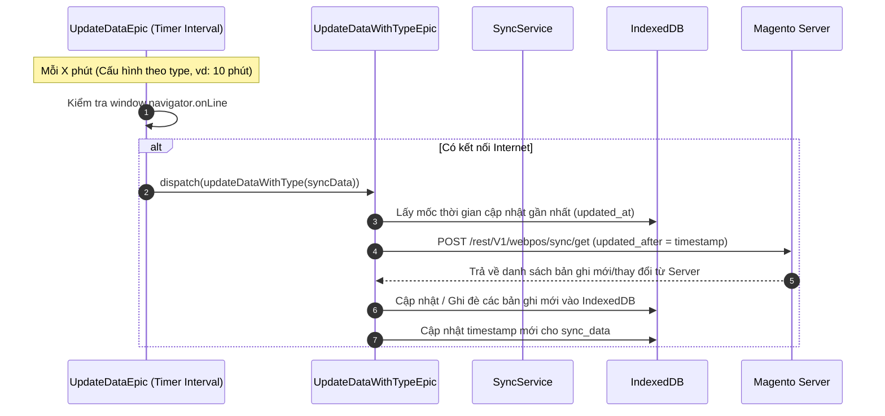

# 🔄 Luồng Dữ liệu: Cơ chế Đồng bộ Dữ liệu (Data Sync Mechanism)

## 1. Tổng quan (Overview)
Magestore WebPOS là ứng dụng PWA hỗ trợ bán hàng **Offline/Online**. Để hoạt động mượt mà khi không có mạng, WebPOS sử dụng cơ chế đồng bộ dữ liệu hai chiều:
1. **Initial Sync (Đồng bộ ban đầu / First Load):** Tải toàn bộ dữ liệu danh mục sản phẩm, kho hàng, khách hàng, cấu hình thuế... từ Magento Backend về lưu trữ dưới trình duyệt (IndexedDB).
2. **Incremental Update Sync (Cập nhật định kỳ Delta):** Chạy ngầm định kỳ (Background Job) để tải các thay đổi mới nhất từ Server về Client dựa trên dấu mốc thời gian (`updated_at`).
3. **Action Log / Offline Queue:** Khi thao tác offline (tạo đơn hàng, tạo khách hàng mới), các hành động được ghi vào bảng `ActionLog` dưới IndexedDB và tự động đẩy (push) lên Server khi có mạng trở lại.

---

## 2. Các thành phần tham gia (Components Involved)

### 🎨 Frontend / Client (ReactJS & Redux Epics)
- **Sync Actions & Reducers:** `SyncAction.js`, `SyncReducer.js`.
- **Epics Quản lý Sync:**
  - `SyncDataEpic.js`: Kiểm tra trạng thái các bảng dữ liệu dưới IndexedDB để khởi chạy luồng sync.
  - `SyncDataWithTypeEpic.js`: Đánh dấu phân trang (Page by Page) và tải từng batch dữ liệu cụ thể (Products, Customers, Stock,...).
  - `UpdateDataEpic.js`: Quản lý hẹn giờ (Timer) định kỳ kéo dữ liệu mới từ Server.
- **Service & Resource Model:**
  - `SyncService.js`: Điều phối và tương tác với DB IndexedDB.
  - `ActionLogResourceModel.js`: Quản lý hàng đợi Action Log đẩy đơn offline lên Server.

### ⚙️ Backend / Server (Magento 2 PHP)
- **REST API Sync Endpoints:** 
  - `POST /rest/V1/webpos/sync/get` (Lấy dữ liệu theo phân trang & mốc thời gian)
  - `POST /rest/V1/webpos/sync/update` (Gửi Action Log offline lên Server)

---

## 3. Thứ tự ưu tiên Đồng bộ (Sync Priority & Sort Order)

Khi ứng dụng POS khởi động, dữ liệu được ưu tiên tải về IndexedDB theo thứ tự phụ thuộc (`sort_order`):

| Thứ tự | Loại Dữ liệu (Data Type) | Mô tả & Lý do phụ thuộc |
| :---: | :--- | :--- |
| **1** | `category` | Danh mục sản phẩm (cần trước để hiển thị cây danh mục). |
| **2** | `product` | Thông tin cơ bản của sản phẩm (SKU, Name, Price, Barcode). |
| **3** | `stock` | Số lượng tồn kho theo từng Location/Warehouse của sản phẩm. |
| **4** | `catalog_rule_product_price` | Giá khuyến mãi / Quy tắc giá áp dụng cho sản phẩm. |
| **5** | `customer` | Danh sách khách hàng và nhóm khách hàng. |
| **6** | `session` | Thông tin ca làm việc (Pos Session/Shift). |
| **7** | `order` | Danh sách đơn hàng lịch sử. |

---

## 4. Sơ đồ Luồng Dữ liệu (Data Flow Diagrams)

### A. Luồng Tải dữ liệu ban đầu (Initial First-Load Sync)

### B. Luồng Cập nhật thay đổi định kỳ (Incremental Update Sync)

---

## 5. Quy tắc nghiệp vụ quan trọng (Gotchas & Important Rules)

1. **Khóa Đơn hàng Offline (Offline Action Log Sync):**
   - Mọi thao tác ghi đơn khi Offline đều tạo 1 record trong bảng `action_log`.
   - Khi có mạng trở lại, hệ thống ưu tiên đẩy toàn bộ `action_log` lên Server xử lý trước khi thực hiện tải dữ liệu mới về (`hasSyncPending()`).

2. **Cập nhật Giá Khuyến mãi (Catalog Rule Price):**
   - Giá Catalog Rule và Stock Item phụ thuộc trực tiếp vào sản phẩm. Do đó, nếu sản phẩm đã sync xong nhưng Catalog Rule chưa sync xong thì trạng thái Product vẫn được tính ở chế độ ONLINE mode để tránh bán sai giá.

3. **Cấu hình Dung lượng Phân trang (Page Size Config):**
   - Cấu hình số lượng bản ghi mỗi lần kéo API được định nghĩa tại Backend Config (`webpos/offline/{type}_pagesize`, mặc định 100 bản ghi/request) nhằm tránh treo trình duyệt hoặc quá tải RAM.
