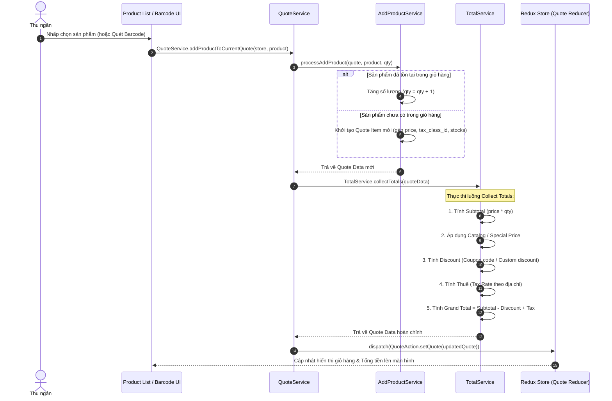

# 🛒 Luồng Dữ liệu: Vòng đời Giỏ hàng & Quote (Cart & Quote Lifecycle)

## 1. Tổng quan (Overview)
Trong Magestore WebPOS, **Quote** (Giỏ hàng) là đối tượng trung tâm quản lý toàn bộ dữ liệu trước khi đặt hàng: danh sách sản phẩm, số lượng, khách hàng, địa chỉ giao hàng, mã giảm giá, thuế và các phương thức thanh toán.

Luồng này bao gồm:
1. **Khởi tạo & Reset Quote:** Tạo giỏ hàng mới với ID duy nhất dạng timestamp.
2. **Thao tác Sản phẩm (Add / Edit / Remove):** Thêm sản phẩm, thay đổi số lượng, tùy chỉnh giá (Custom Price) hoặc chiết khấu (Custom Discount).
3. **Gán Khách hàng & Địa chỉ:** Chọn khách hàng -> Tự động tính toán lại giá theo Nhóm khách hàng (Customer Group).
4. **Tính toán Tổng chi phí (Collect Totals Engine):** Tự động tính toán lại Subtotal, Tax, Shipping Fee, Discount và Grand Total mỗi khi giỏ hàng có thay đổi.

---

## 2. Các thành phần tham gia (Components Involved)

### 🎨 Frontend / Client (ReactJS & Redux)
- **Redux State:** `state.core.checkout.quote`
- **Quote Actions:** `QuoteAction.js` (`ADD_PRODUCT_TO_QUOTE`, `UPDATE_QUOTE_ITEM`, `SET_CUSTOMER_TO_QUOTE`, `COLLECT_TOTALS`).
- **Core Quote Services:**
  - `QuoteService.js`: Điều phối chính cho các thao tác giỏ hàng.
  - `TotalService.js`: Đảm nhận tính toán thuế, giảm giá, tổng tiền (`collectTotals`).
  - `AddProductService.js` & `UpdateProductService.js`: Xử lý thêm/sửa item.
  - `ItemService.js`: Xử lý Custom Price và Custom Discount từng dòng item.

---

## 3. Cấu trúc dữ liệu Quote (Quote Data Structure)

Một đối tượng Quote tiêu chuẩn trong Redux Store có dạng:

```json
{
  "id": 1721832000000,
  "customer_id": 15,
  "customer_group_id": 1,
  "customer_is_guest": 0,
  "grand_total": 150.00,
  "base_grand_total": 150.00,
  "subtotal": 140.00,
  "tax_amount": 10.00,
  "items": [
    {
      "item_id": 101,
      "product_id": 45,
      "qty": 2,
      "price": 70.00,
      "custom_price": null,
      "discount_amount": 0
    }
  ],
  "payments": [],
  "addresses": []
}
```

---

## 4. Sơ đồ Luồng Dữ liệu (Data Flow Diagrams)

### A. Luồng Thêm Sản phẩm & Tính toán Tổng tiền (Add Product & Collect Totals)



---

## 5. Các quy tắc nghiệp vụ cốt lõi (Core Business Rules)

1. **Thay đổi Giá Tùy chỉnh (Custom Price):**
   - Thu ngân có quyền sửa giá trực tiếp cho một item trên POS. Khi có `custom_price`, `TotalService` sẽ bỏ qua giá niêm yết của sản phẩm và tính toán các khoản thuế/giảm giá dựa trên `custom_price` này.

2. **Gán Khách hàng (Customer Assignment):**
   - Khi gán một Khách hàng (`customer_id`), Quote sẽ cập nhật `customer_group_id`. Luồng `collectTotals` sẽ ngay lập tức tính lại giá sản phẩm theo bảng giá ưu đãi của nhóm khách hàng đó.

3. **Reset Quote sau khi Thanh toán:**
   - Ngay sau khi đơn hàng được tạo thành công, `QuoteService.resetQuote()` sẽ được gọi để trả trạng thái giỏ hàng về `initialQuoteReducerState` ban đầu với một `id` timestamp mới.
