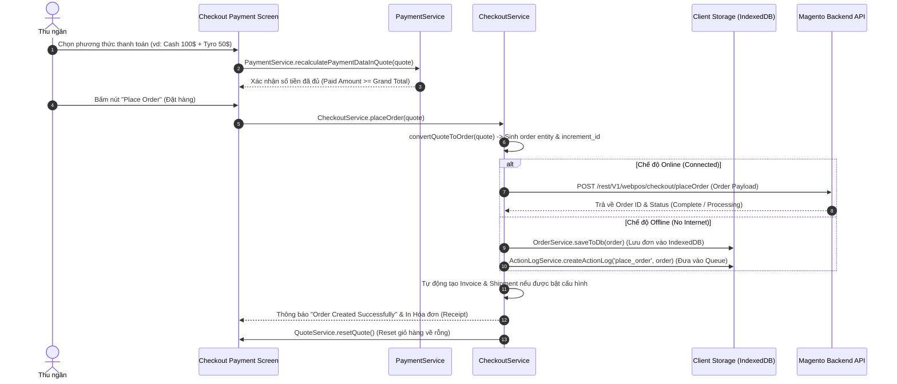
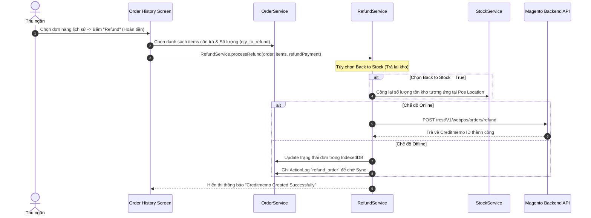

# 💳 Luồng Dữ liệu: Thanh toán, Tạo đơn & Xuất kho (Checkout, Payment, Order & Shipment)

## 1. Tổng quan (Overview)
Luồng **Checkout & Payment** biến một **Quote** (Giỏ hàng) thành một **Order** (Đơn hàng chính thức) trong Magento, đồng thời xử lý các thao tác sau bán hàng:
1. **Take Payment (Thanh toán):** Nhận tiền qua Tiền mặt (Cash), Thẻ (Tyro/EFTPOS) hoặc Thanh toán kết hợp (Split Payment).
2. **Place Order (Đặt hàng):** Chuyển đổi dữ liệu Quote sang Order entity và sinh mã `increment_id`.
3. **Take Shipment & Invoice (Xuất kho & Hóa đơn):** Trừ số lượng tồn kho (Stock) tại Pos Location và tạo hóa đơn tự động.
4. **Refund & Creditmemo (Hoàn tiền):** Nhận lại sản phẩm, hoàn tiền cho khách và nhập trả lại kho.

---

## 2. Các thành phần tham gia (Components Involved)

### 🎨 Frontend / Client (ReactJS & Services)
- **Checkout Services:**
  - `CheckoutService.js`: Điều phối luồng `placeOrder`, chuyển đổi `convertQuoteToOrder`.
  - `PaymentService.js`: Quản lý danh sách phương thức thanh toán, tính toán tiền thối (Change amount).
  - `OrderService.js`: Ghi đơn hàng vào IndexedDB hoặc đẩy trực tiếp lên Magento REST API.
  - `ShipmentService.js` & `InvoiceService.js`: Tạo Shipment/Invoice offline hoặc online.
- **Action Log:** `ActionLogService.js` (Hàng đợi xử lý đơn hàng khi POS ở chế độ Offline).

### ⚙️ Backend / Server (Magento 2 PHP)
- **REST API Checkout Endpoints:** 
  - `POST /rest/V1/webpos/checkout/placeOrder`
  - `POST /rest/V1/webpos/orders/refund`

---

## 3. Sơ đồ Luồng Dữ liệu (Data Flow Diagrams)

### A. Luồng Thanh toán & Đặt hàng (Place Order & Payment Flow)

### B. Luồng Xuất kho & Hoàn tiền (Shipment & Refund Flow)

---

## 4. Các quy tắc nghiệp vụ quan trọng (Gotchas & Important Rules)

1. **Sinh mã Đơn hàng (Custom Increment ID):**
   - Đơn hàng tạo offline được cấp mã `increment_id` tạm thời dựa trên prefix cấu hình của POS Location (vd: `POS1-100023`). Khi sync lên server, Magento sẽ giữ nguyên mã này để đối soát.

2. **Split Payment (Thanh toán phối hợp):**
   - Thu ngân có thể kết hợp nhiều phương thức thanh toán trên cùng 1 đơn hàng (ví dụ: $50 Tiền mặt + $100 Thẻ Tyro). Tổng tiền từ mảng `quote.payments` phải lớn hơn hoặc bằng `grand_total`.

3. **Cập nhật Tồn kho thời gian thực (Stock Adjustment):**
   - Ngay sau khi bấm Place Order thành công ở WebPOS, số lượng tồn kho (`stock_item.qty`) thuộc Location của POS đó sẽ bị trừ ngay lập tức dưới IndexedDB để tránh bán quá số lượng kho khả dụng (Over-selling) trong thời gian offline.
