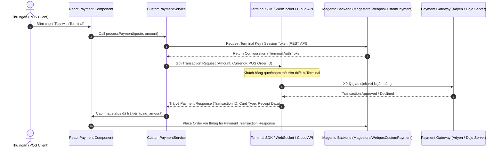

# 💳 WebPOS Payment Terminal Integration Skill

Skill này hướng dẫn quy trình từng bước để phát triển hoặc tích hợp một **Payment Terminal mới** (như Adyen Terminal, Dojo Terminal, Tyro, v.v.) vào hệ thống **Magestore WebPOS**.

---

## 🏗️ Kiến trúc Tổng quan (Architecture Overview)

Luồng tích hợp Payment Terminal trên WebPOS bao gồm 2 phần chính:



---

## 🛠️ Bước 1: Phát triển Backend Module (Magento 2 PHP)

Tạo module Magento 2 mới trong `app/code/Magestore/Webpos[PaymentName]/` (hoặc `WebposCustom/`):

### 1.1 Khai báo Payment Method (`etc/config.xml`)
```xml
<?xml version="1.0"?>
<!--
  ~ Copyright © Magestore. All rights reserved.
  ~ See COPYING.txt for license details.
  -->
<config xmlns:xsi="http://www.w3.org/2001/XMLSchema-instance" xsi:noNamespaceSchemaLocation="urn:magento:module:Magento_Store:etc/config.xsd">
    <default>
        <payment>
            <webpos_custom_terminal>
                <active>1</active>
                <model>Magestore\WebposCustomPayment\Model\Payment\Terminal</model>
                <title>Custom POS Terminal</title>
                <is_webpos>1</is_webpos>
                <group>webpos</group>
            </webpos_custom_terminal>
        </payment>
    </default>
</config>
```

### 1.2 Đăng ký Observer bổ sung thông tin Payment cho WebPOS (`etc/events.xml`)
Lắng nghe sự kiện `webpos_get_payment_after` để đẩy cấu hình terminal xuống client WebPOS:

```xml
<?xml version="1.0"?>
<!--
  ~ Copyright © Magestore. All rights reserved.
  ~ See COPYING.txt for license details.
  -->
<config xmlns:xsi="http://www.w3.org/2001/XMLSchema-instance" xsi:noNamespaceSchemaLocation="urn:magento:framework:Event/etc/events.xsd">
    <event name="webpos_get_payment_after">
        <observer name="webpos_custom_terminal_get_payment_after" instance="Magestore\WebposCustomPayment\Observer\GetPaymentAfter" />
    </event>
</config>
```

---

## 🎨 Bước 2: Phát triển Client Extension (ReactJS / WebPOS Client)

Tạo extension module trong `client/pos/src/extension/webpos-[payment-name]/` (hoặc `webpos-custom/`):

### 2.1 Định nghĩa Payment Service (`service/payment/type/CustomTerminalPaymentService.js`)
Class kế thừa từ `AbstractPaymentService` để xử lý trigger kết nối tới thiết bị Terminal:

```javascript
import AbstractPaymentService from "../AbstractPaymentService";
import ServiceFactory from "../../../framework/factory/ServiceFactory";

export class CustomTerminalPaymentService extends AbstractPaymentService {
    static className = 'CustomTerminalPaymentService';

    /**
     * Trigger payment flow with Terminal
     * @param {Object} store
     * @param {Object} payment
     * @param {number} amount
     * @return {Promise<any>}
     */
    processPayment(store, payment, amount) {
        return new Promise((resolve, reject) => {
            // 1. Gọi SDK Terminal hoặc Cloud API của Adyen/Dojo
            // 2. Lắng nghe trạng thái thành công
            // 3. Trả về thông tin transaction
        });
    }
}

export default ServiceFactory.get(CustomTerminalPaymentService);
```

### 2.2 Đăng ký Payment Factory trong `etc/config.js`
Đăng ký Payment Service và UI Component trong file cấu hình extension:

```javascript
import CustomTerminalPaymentService from "../service/payment/type/CustomTerminalPaymentService";
import CustomTerminalComponent from "../view/component/payment/CustomTerminalComponent";

export default class Config extends ModuleConfigAbstract {
    register() {
        this.payment = {
            'webpos_custom_terminal': {
                service: CustomTerminalPaymentService,
                component: CustomTerminalComponent
            }
        };
    }
}
```

---

## ⚡ Các lưu ý cốt lõi (Best Practices & Gotchas)

1. **Xử lý Hủy / Cancellation Flow:**
   - Luôn thiết kế nút **Cancel / Abort Transaction** trên UI WebPOS và gửi lệnh hủy tới Terminal để tránh treo thiết bị khi khách hàng đổi ý.
2. **Offline & Fallback Mode:**
   - Nếu Terminal là kết nối Cloud (Adyen Cloud Terminal Api / Dojo Cloud), khi rớt mạng POS phải hiển thị cảnh báo chuyển sang **Manual Card Entry** hoặc **Pay Offline**.
3. **In Hóa đơn (Receipt Printing):**
   - Lấy chuỗi `merchant_receipt` và `customer_receipt` trả về từ Terminal để ghép vào template in hóa đơn WebPOS.
4. **Cơ chế Timeout cho Payment Terminal (Idle/Inactivity Timeout Pattern):**
   - **Tuyệt đối không sử dụng Fixed Timeout** 60s đếm từ lúc bấm gửi request (vì khiến giao dịch bị ngắt sai khi khách/thu ngân thao tác chậm).
   - **Luôn triển khai Idle Timeout Pattern**: Tạo timer 60s và tự động gọi `resetIdleTimeout()` trong **tất cả các callback tương tác** (`statusMessageCallback`, `questionCallback`, `receiptCallback`) để gia hạn thời gian đếm ngược.
   - Chỉ khi 60s liên tục **không có phản hồi mới nào** từ Terminal (do rớt mạng/terminal đơ), timer mới kích hoạt hủy giao dịch (`cancelCurrentTransaction`) và hiển thị báo lỗi Timeout.
5. **Quy định Export JS trong WebPOS Rewrite/Service (Tránh lỗi ESLint `import/no-anonymous-default-export`):**
   - Không `export default` trực tiếp hàm factory vô danh: `export default function (BaseClass) { ... }`.
   - Bắt buộc khai báo gán vào hằng số có tên (named constant) trước khi export ở cuối file:
     ```javascript
     const CustomServiceRewrite = function (BaseClass) {
         return class CustomServiceRewriteClass extends BaseClass { ... };
     };

     export default CustomServiceRewrite;
     ```

