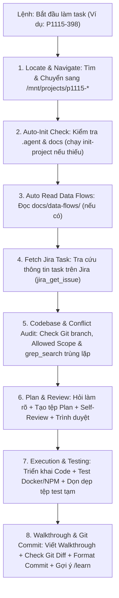

# User Workflow, Environment & Personal Goals Rules

## 1. Environment & Execution Setup
- **Frontend (WebPOS Client)**: Run directly using `npm` (`npm run upgrade`, `npm run test`...).
- **Backend (Magento 2 PHP)**: PHP is NOT installed on the host machine. All PHP/Magento CLI and PHP unit test commands MUST be run via Docker container (e.g. `docker exec ...`).

## 2. Task Initialization & Project Navigation Workflow
Whenever the user specifies a task ID to start working (e.g., `P1115-398` or `bắt đầu làm task P1115-398`), AI MUST
strictly follow this sequence:

1. **Locate & Navigate to Project Directory**:
   - Extract project code (e.g. `P1115`) from task ID.
   - Search for matching folder under `/mnt/projects/` (case-insensitive, e.g. `/mnt/projects/p1115-*`).
   - Change current working directory context to that project folder.
2. **Auto-Init Check & Execution**:
   - Check if `.agent` and `docs` directories exist in the target project folder.
   - If missing, automatically execute skill `init-project` to generate symlinks and templates.
3. **Auto Read Data Flows**:
   - Check if `docs/data-flows/` exists. If present, read `README.md` and related data flow specs.
4. **Fetch & Analyze Jira Task**:
   - Query Jira MCP (`jira_get_issue`) using task ID to read summary, description, comments, and criteria.
5. **Git Branch, Codebase & Plugin Conflict Audit**:
   - Check current git branch.
   - Inspect codebase strictly adhering to Allowed Scope: `app/code/Magestore/*Bug*`, `app/code/Magestore/*Fix*`,
     `app/code/Magestore/*Custom*`, `client/pos/src/extension/*fix*`, `client/pos/src/extension/*bug*`,
     `client/pos/src/extension/*custom*`.
   - Run `grep_search` to audit for existing plugin/rewrite conflicts before planning.
6. **Plan Creation, Self-Review & User Approval**:
   - Ask proactive clarifying questions if anything is ambiguous.
   - Create plan file: `Plans/{ma_du_an}-{ma_issue}-{noi_dung_task_tom_tat_20_ki_tu}.md` and `implementation_plan.md`.
   - Audit own plan (Allowed scope, line length <= 120, copyright headers, plugin conflicts).
   - Present plan for user review & approval before writing any code.
7. **Execution, Automated Testing & Test Cleanup**:
   - Implement extension/plugin code upon user approval.
   - Run automated tests (`npm` for JS, `docker exec` for PHP).
   - Clean up all temporary test files before proceeding to git status/commit.
8. **Walkthrough, Git Commit Standards & Proactive Learning**:
   - Write execution summary & test evidence to `walkthrough.md`.
   - Review `git status` and `git diff`. Format commit: `{Fix/Feat} [{mã dự án} - {issue id}]: {ticket ID/summary}`.
   - Proactively suggest `/learn` if task involved complex bug fixes or reusable patterns.

## 3. Communication & Clarification Mandate
- **Strict Clarification Rule**: Always ask the user directly for clarification whenever a requirement, design detail, error log, or task description is ambiguous, missing, or unclear. Never make blind assumptions or patch symptoms silently.

## 4. Automation & Code Optimization Objectives
- **Phase 1 (Time & Workflow Optimization)**: Maximize automation in daily tasks (auto-tracing, proactive subagents, docker/npm testing, self-review, handover notes).
- **Phase 2 (WebPOS Codebase Audit & Performance Optimization)**: Proactively observe and audit WebPOS client/backend code during tasks to identify bottlenecks, race conditions, offline IndexedDB sync issues, or anti-patterns, and propose refactoring/optimization recommendations.
