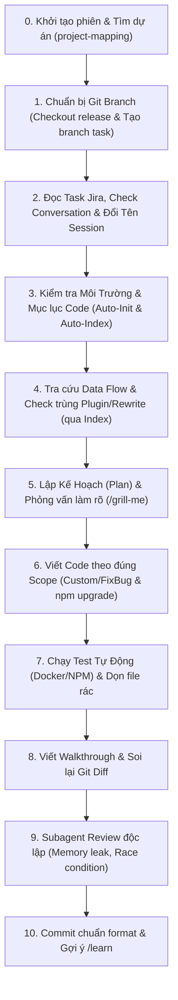

# User Workflow, Environment & Personal Goals Rules

## 1. Environment & Execution Setup
- **Project Root Location**: TẤT CẢ các dự án mã nguồn của lập trình viên đều nằm tại `/mnt/projects/` (ví dụ:
  `/mnt/projects/p1062-jw.com.au`, `/mnt/projects/p1115-cremagarage-com-au`, ...).
  - AI BẮT BUỘC tra cứu đường dẫn dự án trực tiếp từ file rule `~/.agent/rules/project-mapping.md` (In-Memory Lookup).
  - Khi bắt đầu bất kỳ task nào, AI BẮT BUỘC đặt Cwd trực tiếp vào thư mục dự án tương ứng trong `/mnt/projects/<ma_du_an>-*`.
  - *(Quy định cấm chạy shell tại `/home/bss`: xem `~/.agent/rules/workspace-search-priority.md`.)*

- **Frontend (WebPOS Client)**: Run directly using `npm` (`npm run upgrade`, `npm run test`...).
- **Backend (Magento 2 PHP)**: PHP is NOT installed on the host machine. All PHP/Magento CLI and PHP unit test
  commands MUST be run via Docker container (e.g. `docker exec ...`).

## 2. Task Initialization & Project Navigation Workflow
Whenever the user specifies a task ID to start working (e.g., `P1062-537`, `P1115-398` hoặc `bắt đầu issue ...`), AI
MUST strictly follow this sequence:

0. **Conversation History Lookup & Project Navigation**:
   - **Tra cứu Conversation cũ (Auto-Resume Check)**: Kiểm tra danh sách Conversation History xem đã có phiên hội thoại
     nào trước đó liên quan đến mã task `{ma_du_an}-{ma_issue}` hay chưa.
     - **Nếu ĐÃ TỒN TẠI conversation cho issue này**: Ưu tiên gợi ý/mở tiếp conversation cũ để làm việc tiếp,
       kế thừa toàn bộ context và artifact đã có.
     - **Nếu CHƯA CÓ conversation**: Tiếp tục luồng xử lý trên phiên hiện tại.
   - **Định vị dự án (In-Memory Lookup)**: Tra cứu trực tiếp trong `~/.agent/rules/project-mapping.md` và đặt `Cwd`
     sang `/mnt/projects/<ma_du_an>-*` ngay lập tức (0 lệnh shell).
1. **Git Branch Preparation & Baseline Sync**:
   - Kiểm tra branch hiện tại (`git status`, `git branch --show-current`).
   - Đảm bảo branch phát triển bắt đầu từ nhánh `release` sạch: `git checkout release && git pull origin release`.
   - Tạo branch mới theo chuẩn: `git checkout -b feature/{ma_du_an}-{ma_issue}` (hoặc `fix/...`).
2. **Fetch & Analyze Jira Task (Status Transition & Conversation Renaming)**:
   - Tra cứu task qua `jira_get_issue` lấy summary, description, comments, acceptance criteria.
   - **Xử lý trạng thái Jira:**
     - Nếu trạng thái là **`To Do`** (hoặc `Open`, `Backlog`): Tự động chuyển sang **`In Progress`** (hoặc `In Process`) qua `jira_transition_issue`.
     - Nếu trạng thái **KHÔNG PHẢI `To Do`** (đã là `In Progress`, `In Review`, `Done`...): **TUYỆT ĐỐI KHÔNG ĐƯỢC THAY ĐỔI TRẠNG THÁI**.
   - **Đổi tên Conversation (Session Renaming)**:
     - Sau khi lấy thông tin task từ Jira/Git Branch và chuyển status (nếu là session mới chưa có trước đó):
       BẮT BUỘC đặt/đổi tên Conversation thành `{ma_du_an}-{ma_issue}-{noi_dung_task_tom_tat_20_ki_tu}`
       để đồng bộ 100% với tên file Plan và dễ dàng tìm kiếm/tiếp tục sau này.
3. **Environment & Index Setup (Auto-Init & Auto-Index)**:
   - Kiểm tra `.agent/` và `docs/` (chạy skill `init-project` nếu thiếu).
   - Kiểm tra `docs/data-flows/INDEX.md`. Nếu chưa có (dự án mới) $\rightarrow$ spawn Subagent tạo bộ index 4 matrix.
4. **Knowledge Retrieval & Conflict Audit via Index**:
   - Đọc đúng Data Flow liên quan đến domain của task (Payment, Cart, Reward...).
   - Mở `docs/data-flows/client/extension-plugins.md` / `extension-rewrites.md` đối soát xem method/class mục tiêu đã có extension nào can thiệp trước đó chưa (tránh xung đột logic mà không cần grep).
5. **Plan Creation, Clarification & Approval**:
   - Phỏng vấn làm rõ nếu yêu cầu mơ hồ (đặt 2–4 câu hỏi trắc nghiệm qua `/grill-me`).
   - Tạo tệp `Plans/{ma_du_an}-{ma_issue}-{noi_dung_task_tom_tat_20_ki_tu}.md` và artifact `implementation_plan.md`.
   - **Chờ User duyệt (Approve) mới được bắt đầu viết code.**
6. **Code Implementation (Strict Scope)**:
   - Triển khai code trong vùng cho phép (`*Custom*`, `*FixBug*` / `src/extension/`).
   - Nếu tạo module extension WebPOS mới: Bắt buộc chạy `npm run upgrade` để đăng ký vào `modules.json`.
   - Bổ sung entry mới vào file index `docs/data-flows/`.
7. **Automated Testing & Artifact Cleanup**:
   - Chạy test tự động qua Docker container (`docker exec phpunit`) hoặc NPM.
   - **Bắt buộc tự động xóa bỏ toàn bộ file test tạm thời trước khi chuyển bước.**
8. **Walkthrough & Git Diff Verification**:
   - Ghi nhận kết quả thực thi vào `walkthrough.md`.
   - Tự rà soát `git diff` đảm bảo: Dòng code <= 120 ký tự, Copyright Header, Thẻ XML match 100%.
9. **Subagent Code Review & Risk Analysis**:
   - Gọi Subagent độc lập (`Role: Code Reviewer & Risk Analyst`) soi lại diff tìm Memory Leak, Race Condition, Null Pointer Safety.
10. **Git Commit Standards & Proactive Learning**:
    - Commit đúng chuẩn: `{Fix/Feat} [{mã dự án} - {issue id}]: {ticket ID/summary}`.
    - Đề xuất chạy `/learn` nếu task có bài học/kinh nghiệm quý cần ghi nhớ.

## 3. Communication & Clarification Mandate
- **Strict Clarification Rule**: Always ask the user directly for clarification whenever a requirement, design
  detail, error log, or task description is ambiguous, missing, or unclear. Never make blind assumptions or patch
  symptoms silently.

## 4. Automation & Code Optimization Objectives
- **Phase 1 (Time & Workflow Optimization)**: Maximize automation in daily tasks (auto-tracing, proactive subagents,
  docker/npm testing, self-review, handover notes).
- **Phase 2 (WebPOS Codebase Audit & Performance Optimization)**: Proactively observe and audit WebPOS
  client/backend code during tasks to identify bottlenecks, race conditions, offline IndexedDB sync issues, or
  anti-patterns, and propose refactoring/optimization recommendations.
